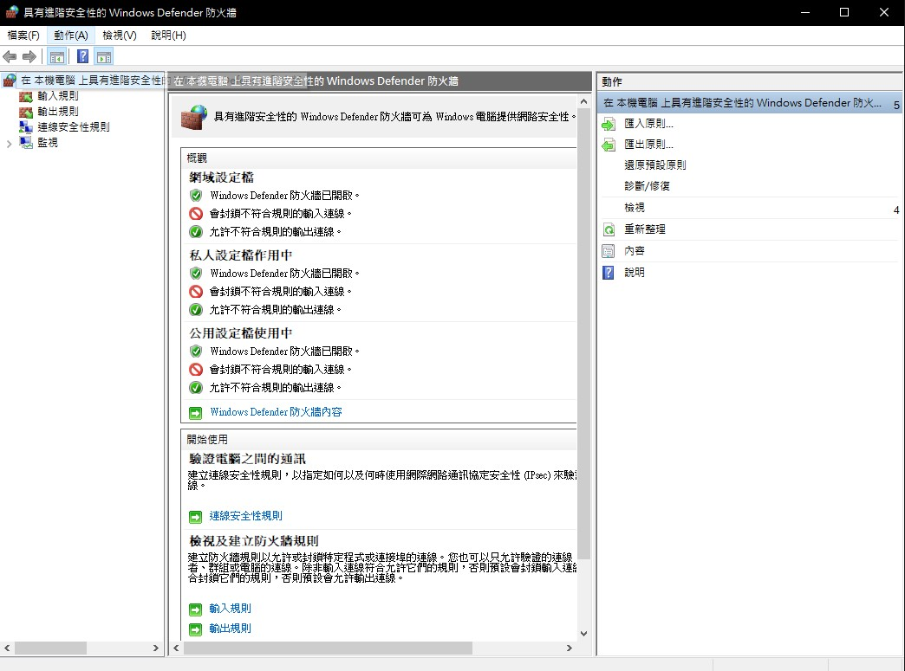
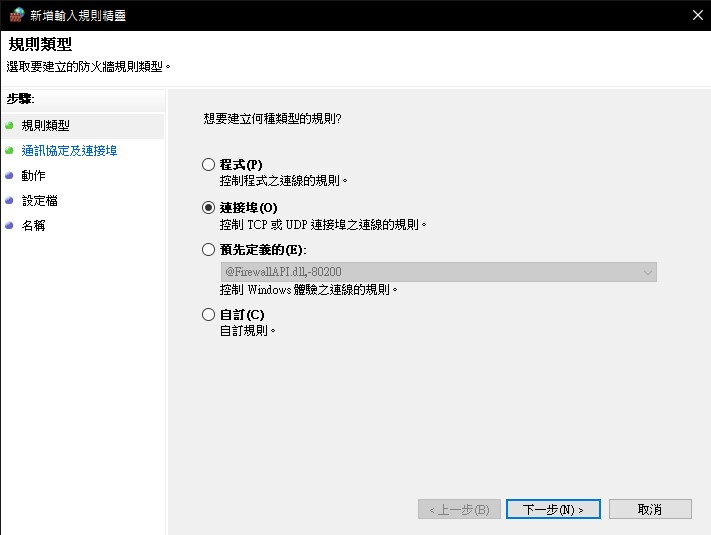

# Server keyboard control
>Simple keyboard control:
  
# Setting about Tello edu
> Enter Windows' setting and search "防火牆與網路保護“

> Enter "進階設定"

> Add new input rule

> We need to add UDP port: 11111, 8889, 8890. Follow the steps below (If this setting don't work try to shut down firewall **temporary**)

