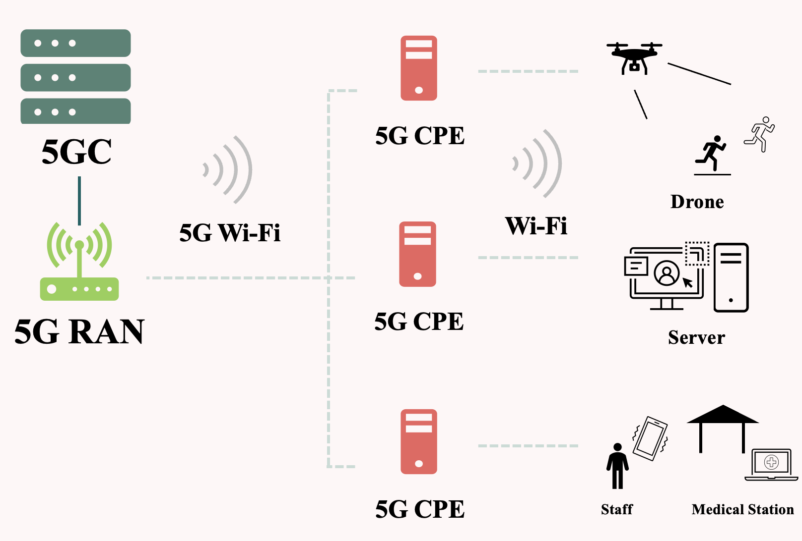
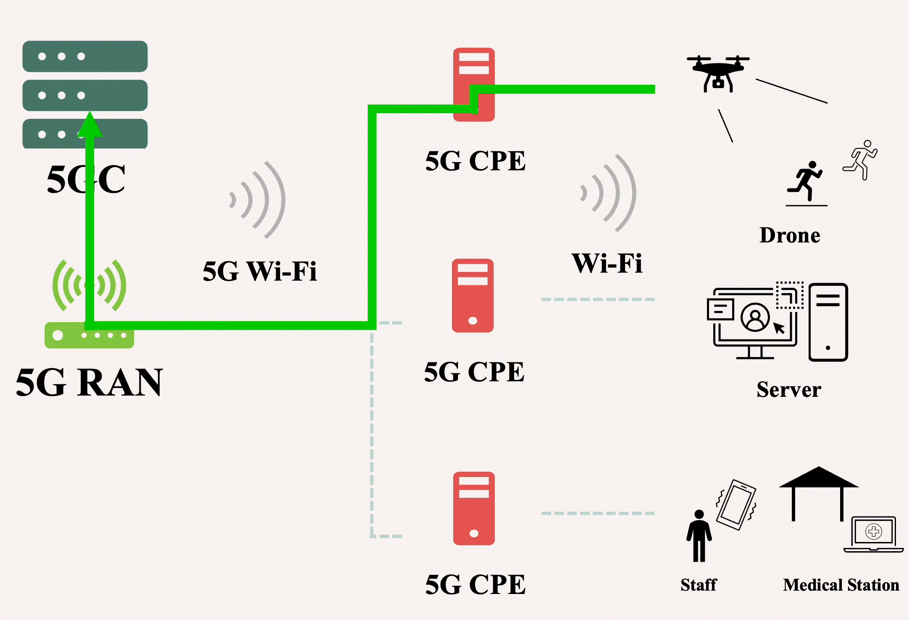
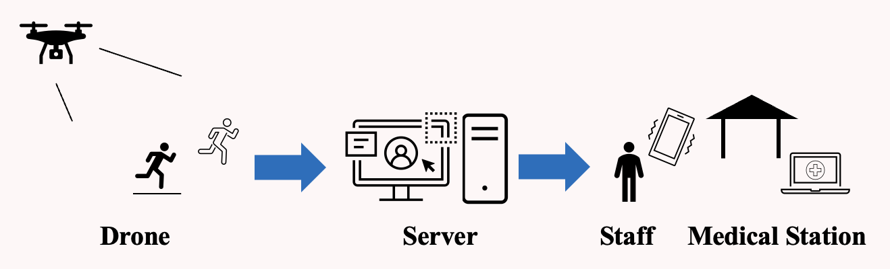
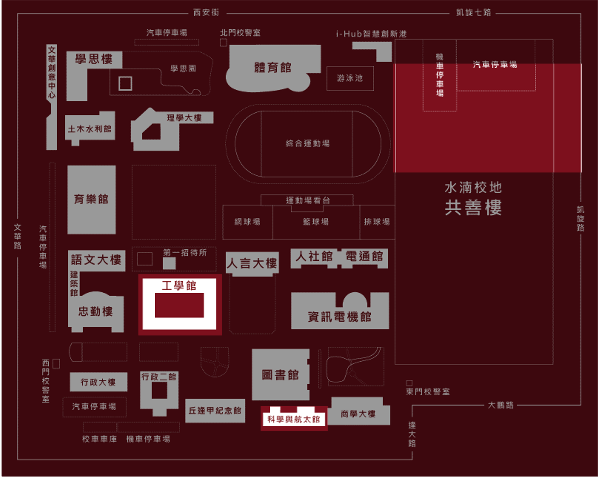
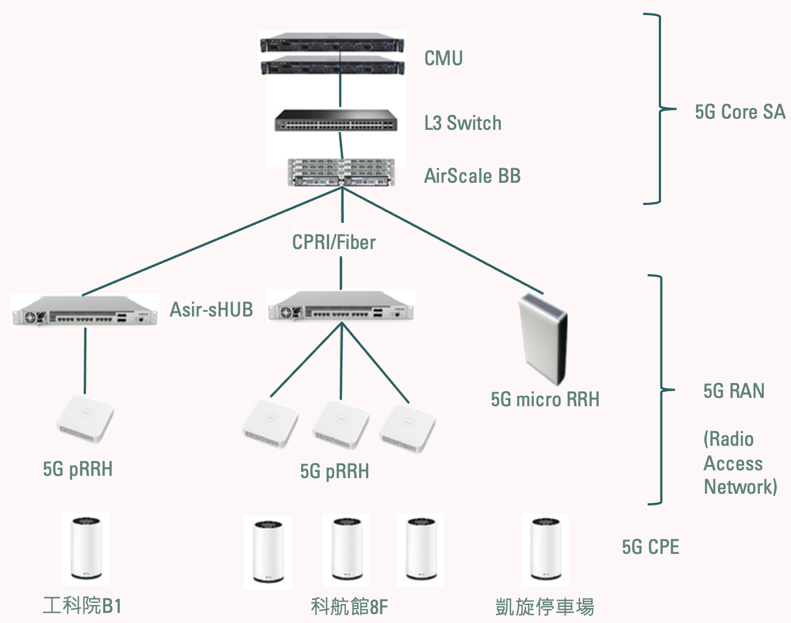
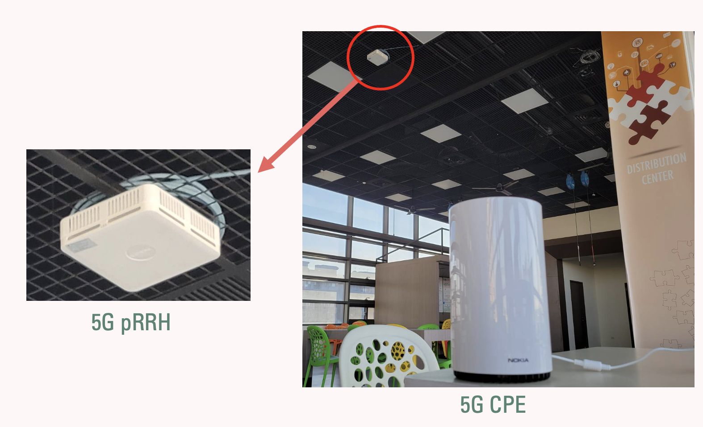
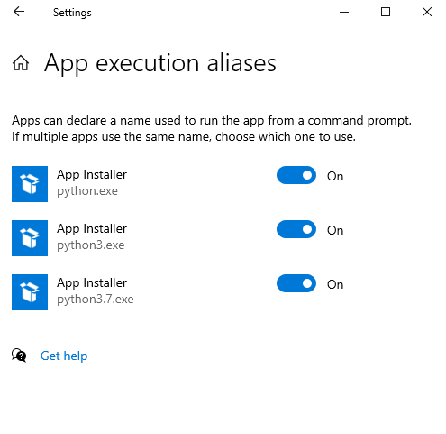

# Helios 
# Introduction
Helios is ***Zaviel Chung's*** undergraduate graduate project in ***Feng Chia University***.
Helios is a system like below image showing. Helios is been created for the purpose of saving someone who facing accidental problem in any kinds of activities. We suppose the sport activity with a short length of runway. 

With drones at the setting locate, its will detect if runner fall down or have a pose to drone. If so our staff in medical station or staff who notice the warning on their phonet will be able to check the stream from the drone. They will find the runner with the warning shows and give runner the help they need. 
# Using
We use drone Tello edu and using [Pytorch](https://pytorch.org/) and [Openpifpaf](https://openpifpaf.github.io/intro.html) to fullfill Image detection. About our simple Helios APP, we use [Kivy](https://kivy.org/) as our APP development framework. 


>Simple structure:

# Feng Chia University's 5G environment

>The Ａrea covering 5G. The 5G equipment is provided by MIC:


>Our 5G structure in Science and Aerospace building 8 floors:


>CPE and 5G pRRH in Science and Aerospace building 8 floors:

# Installation (Server's environment for Windows)
***[Anaconda](https://docs.anaconda.com/anaconda/install/index.html) -> [Git](https://gitforwindows.org/
) -> Python3 ([alias set up](#alias-set-up-windows)) -> Python lib -> terminal!***

(settings below are for my lab's Windows PCs' set up.)

***Python lib required:***
>torch (1.12.1+cpu):

    pip install torch==1.12.1 
    
>torchvision (0.13.1+cpu):

    pip install torchvision==0.13.1
     
>cv2: 

    pip install cv2
     
>openpifpaf: 

    pip install openpifpaf
     
>av: 

    pip install av
     
>djitellopy: 

    pip install djitellopy
     
>tellopy: 

    pip install tellopy
     
>imutils: 

    pip install imutils

>base64: 

    pip install base64
# Alias set up (Windows)
To avoid key in python or python3 in cmd direct to Microsoft store.

Go to ```Settings →  Apps →  App execution aliases``` and turn off every installer are associated with Python.



Since we install Python via Anaconda, so we won's need to concern about setting Python's into root. But if some one need it check this [answer](https://stackoverflow.com/a/58773979).
# What we have done.
We have made integration of real time stream from drone, pose detection and showing the results of warning and stream to our APP.  

In November, we have participated in the Chunghwa Telecom 5G Innovation Application competition and be promoted in preliminary contest. 
# What we can improve?
## About 5G integration with Helios:

  Feng Chia University has the 5G environment for us to test which is something other can't. But due to the time limit of the 5G competition mention in above paragraph, we used 5G with Helios without measuring what the different with 4G and discrbing the advantage of using 5G. The things I mention are what we need to go on.
## About machine learning:

  We have used Openpifpaf with Pytorch for getting the keypoints prediction on limbs. Since Helios is my first project to self-learning about machine learning, so I only have learn about the image processing and the guide of machine learning. 
  
  Recently, I have learned about CNN (convolutional neural network) and the way to approuch it, practicing them. The things we need to bring in Helios is the more advanced algorithm for detecting fall down and start to train some model to detect pose we want.
